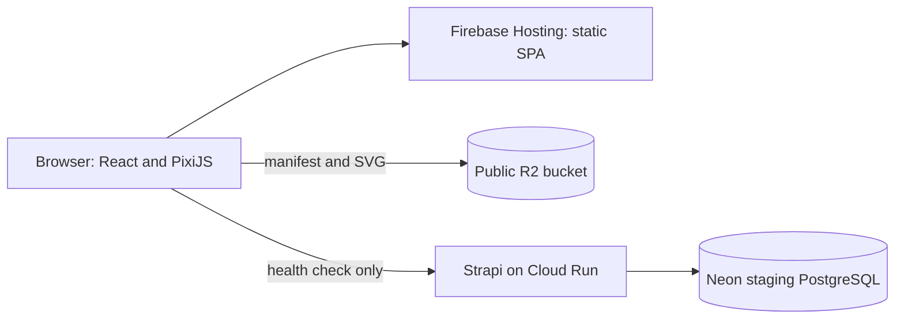
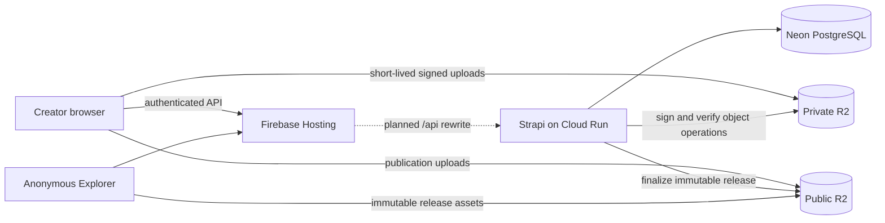

# Fantasy Map Builder architecture

Fantasy Map Builder turns a Creator's private editable Map into an immutable Published Version that an anonymous Explorer can read. This document distinguishes the deployed Phase 0 prototype from the planned MVP. [CONTEXT.md](CONTEXT.md) defines domain language; [technical design](docs/technical-design.md) and [data model](docs/data-model.md) hold detailed contracts.

## What runs today

Phase 0 is a read-only walking skeleton. It proves the cross-provider path, not the editor or publication workflow.

| Component | Current responsibility | Evidence and limit |
|---|---|---|
| `atlas/` | Vite SPA renders one static 2048×1024 map through `@pixi/react`. | Browser checks passed on desktop and mobile. No pan, zoom, editor, sign-in, or Lore yet. |
| `packages/contracts/` | Validates the Phase 0 static manifest. | One image URL and fixed dimensions; this is not the future Published Version manifest. |
| Firebase Hosting | Serves `atlas/dist` and falls back to `index.html` for SPA routes. | Staging site is live; there is no `/api/**` rewrite yet. |
| Public R2 | Serves an immutable demo manifest and SVG through staging `r2.dev`. | Anonymous browser GET and CORS checks passed. |
| `atlas-cms/` on Cloud Run | Runs Strapi and exposes unauthenticated `GET /api/health`. | Health is live. No Creator, Map, Draft, or publication API is implemented. |
| Neon staging | Holds Strapi's database tables through a dedicated staging role. | Migrations prove database connectivity; no application Map data model is implemented. |
| Private R2 | Reserved for future Draft objects. | Public `r2.dev` is disabled; anonymous GET of a known object returned HTTP 401. Signed upload behavior remains untested. |
| Local Compose | Runs CMS, PostgreSQL, and an S3-compatible object store for development. | Local object-store behavior does not establish R2 behavior. |

Staging uses Firebase project `atlas-project-509605`, Cloud Run region `asia-southeast1`, Neon branch `staging` in AWS `ap-southeast-1`, and two Cloudflare R2 buckets. Production uses separate resources later. Deployment URLs, secret names, and checks live in the staging runbook and [Phase 0 evidence](docs/agents/phase-0-progress.md); credentials do not belong here.

## Planned MVP boundaries

- **React** owns accessible controls, forms, routing, Lore, and coarse editor state. **PixiJS** owns the high-frequency viewport. A future Terrain Engine owns versioned deterministic source fields and derived tiles in a Web Worker; React does not receive every brush sample.
- **Canvas Document** owns fixed layer order, authored objects, session-only undo, and canonical editor state. Seam copies are rendering artifacts; one authoritative object exists per feature.
- **Draft Persistence** owns upload-before-manifest ordering and optimistic `draftRevision` checks. PostgreSQL holds ownership, queryable content, and the current Draft pointer; private R2 holds large immutable editor objects.
- **Identity and Ownership** uses Strapi Users & Permissions with Google as the only Creator sign-in provider. Strapi Admin remains separate. Firebase Authentication is not part of the MVP. Every private operation checks the authenticated Creator and Map ownership.
- **Publication** creates a new immutable public R2 prefix, verifies required objects, then transactionally switches `publishedReleaseId` and search projections in Neon. Failure leaves the previous Published Version available.
- **Public Map Query** resolves Public and Unlisted URLs from the active Published Version. Discovery, profiles, and global search include eligible Public Maps only. Anonymous clients never fetch editable Draft source data.

The future Hosting `/api/**` rewrite makes browser API calls same-origin. Google OAuth's backend callback remains an explicit Cloud Run URL. Browser sign-in, secure `__session` forwarding, presigned R2 operations, and CORS need deployed integration tests before those paths are accepted.

## Data and failure rules

1. A Map has one Creator. Coordinates wrap east-west and stop north-south; stored features are never duplicated across the seam.
2. Elevation, temperature, and moisture are source fields. Land, coastline, biome, hill-shading, and contours are derived results, not separate editable truth.
3. A Draft revision advances only after all referenced private objects exist. A stale editor receives a conflict rather than overwriting a newer Draft.
4. Public routes read one active immutable release. A failed publish cannot expose mixed terrain and Lore or replace the prior release.
5. Unpublishing, suspension, and deletion remove public route and search eligibility before asynchronous object cleanup. Direct immutable asset URLs may remain readable until cleanup or cache expiry.
6. The browser receives narrowly scoped, short-lived object URLs. Strapi holds R2 credentials and validates object keys, size, type, and integrity before committing references.

The [technical design](docs/technical-design.md) specifies module interfaces, object layout, and tests. The [data model](docs/data-model.md) specifies planned tables, relations, and invariants. Both are target designs until their phases are implemented.

## Build progression

The [implementation plan](docs/implementation-plan.md) owns phase scope and exit checks. GitHub Issues own actionable tickets; the phase list here shows dependencies, not passing evidence.

| Order | Phase and issues | Delivered capability |
|---|---|---|
| Complete | Phase 0, #1 | Read-only staging map, R2 assets, CMS health, Neon connection. |
| Gate before Phase 1 | #19 | Resolve remaining dependency triage and required integration checks. |
| Next, after #19 | Phase 1, #2–3 | Versioned deterministic terrain, viewport, and continuous property painting in memory. |
| Then | Phase 2, #4–6 | In-memory freehand art, Symbol Stamps, Feature Strokes, and editor behavior. |
| Then | Phase 3, #7–11 | Identity, ownership, private Draft persistence, conflicts, and regeneration. |
| Then | Phase 4, #12–13 | Points of Interest, Lore, and image upload. |
| Then | Phase 5, #14–16 | Atomic publication, anonymous exploration, discovery, and profiles. |
| Last MVP phase | Phase 6, #17–18 and #20 | Moderation, deletion, production launch checks, and recovery. |

Before planning each next phase, use `/grill-with-docs` against live code, glossary, ADRs, issues, and observed build evidence. The exact Phase 1 benchmark device or runner and run count remain unresolved; choose them before performance acceptance. Resolve missing or conflicting requirements before setting acceptance. The current Phase 0 UI is a prototype; [DESIGN.md](DESIGN.md) defines the visual direction for subsequent screens.

## Decisions and operations

[ADR 0001](docs/adr/0001-publish-map-as-one-unit.md) fixes map-wide publication. [ADR 0002](docs/adr/0002-use-low-cost-managed-deployment.md) records cross-provider managed infrastructure. [ADR 0003](docs/adr/0003-use-strapi-managed-google-oauth.md) chooses identity authority. [ADR 0004](docs/adr/0004-publish-immutable-release-snapshots.md) fixes release semantics. [ADR 0005](docs/adr/0005-version-generated-terrain.md) fixes the Chromium/Firefox desktop reproducibility boundary per generator version.

Local and staging procedures belong in `docs/runbooks/`. Production setup, domains under `kofeejan.com`, operational hardening, and rollback remain follow-up work; do not infer their completion from staging.
