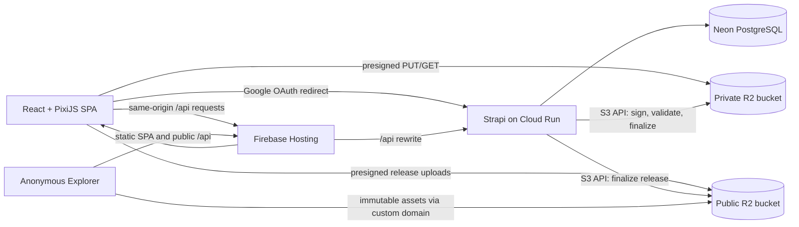

# Fantasy Map Builder MVP Technical Design

## Implementation status and repository boundaries

The diagram and deep modules below describe the target MVP, not deployed infrastructure. Current Phase 0 code lives in the root npm workspace: `atlas/` (React, PixiJS, Vite), `atlas-cms/` (Strapi), and `packages/contracts/` (a versioned static-map manifest). `compose.yaml` runs local Strapi, PostgreSQL, and S3-compatible storage. The Neon `staging` branch exists as a child of `production`, but the CMS is not connected to it. Google Cloud project `atlas-project` is reported as integrated with Firebase. R2 buckets `atlas-draft-private` and `atlas-published-public` exist, but neither has CORS or a public route. Firebase Hosting and Cloud Run deployments have not been verified.

The Phase 0 static manifest is a walking-skeleton contract. It carries one image URL for a 2048×1024 map and is not the full Published Version manifest described later. The local fixture can change; staging uses an immutable release key. Future Terrain Engine, Canvas Document, Draft Persistence, and Publication modules remain unimplemented.

The browser renders DOM controls in React and map content through `@pixi/react` v8. The backend exposes a minimal unauthenticated health route. Local object storage validates development wiring only; staging must verify R2's presigned URL, CORS, and metadata behavior separately.

## Design goals

- Keep the high-frequency editor responsive on ordinary desktop hardware.
- Make Draft autosave incremental and inexpensive.
- Publish terrain, interactive content, and Lore as one coherent unit.
- Keep the prior Published Version available through every failed publish attempt.
- Use low-cost managed infrastructure without putting large binary map data in PostgreSQL.
- Concentrate complex behavior behind small, testable module interfaces.

## System architecture



### Deployment responsibilities

- **Firebase Hosting** serves the static React SPA through its CDN and rewrites browser `/api/**` requests to Cloud Run.
- **Cloud Run** runs one stateless Strapi container and scales to zero for the low-traffic MVP.
- **Neon PostgreSQL** stores identity, ownership, authoring content, metadata, search projections, and current Draft/Published pointers. Strapi uses Neon's pooled connection endpoint.
- **Private Cloudflare R2 bucket** stores Draft terrain tiles, freehand tiles, temporary uploads, and immutable Draft manifests. It has no public domain.
- **Public Cloudflare R2 bucket** stores immutable release packages and uses a custom domain with cache-friendly headers. Staging uses `atlas-assets-staging.kofeejan.com`; the `r2.dev` URL remains disabled.
- **Google OAuth through Strapi Users & Permissions** is the sole Creator identity flow. The provider callback uses the configured absolute Cloud Run backend URL; authenticated browser API calls use the Firebase Hosting origin. Refresh mode uses a secure, HttpOnly `__session` cookie because Hosting forwards only that cookie name to Cloud Run.

Place Cloud Run and Neon in the closest practical regions and measure cross-provider latency before production. Use an Asia-Pacific R2 location hint when it matches the initial audience, while treating the hint as placement guidance rather than an application guarantee.

## Frontend structure

Use a TypeScript React SPA built with Vite. React owns routing, dialogs, forms, Lore editing, search, authentication state, and accessible controls. PixiJS owns the high-frequency map viewport.

Do not mirror pointer movement or every brush sample into React state. `@pixi/react` mounts the PixiJS application and scene; the future editor communicates with the map engine through commands and coarse observable state such as selection, save status, and active tool.

PixiJS should use its production-recommended WebGL renderer. Terrain buffers become dynamic texture sources; stamps come from sprite sheets; strokes and Hotspots use retained scene objects. The published map uses a flattened base texture plus lightweight interactive overlays.

## Deep modules and seams

### Terrain Engine module

Interface responsibilities:

- Create deterministic source fields from a seed and generator settings.
- Apply a terrain brush command.
- Derive biome, land/water, coastline, hill-shading, water tint, and contours for dirty tiles.
- Apply horizontal wrapping and vertical clamping consistently.

Implementation:

- Owns typed arrays and deterministic noise/math.
- Runs in a Web Worker so generation and brush derivation do not block the UI.
- Returns dirty tile results rather than exposing internal arrays to callers.
- Uses pure kernels internally, making deterministic behavior testable without PixiJS.

### Canvas Document module

Interface responsibilities:

- Apply one editor command.
- Undo or redo within the current session.
- Return render changes and persistence changes.
- Produce a canonical manifest for autosave or publication.

Implementation:

- Owns fixed-layer ordering, stamps, Feature Strokes, freehand tile references, Hotspots, and session command history.
- Hides object selection, transform rules, seam duplication for rendering, dirty tracking, and command coalescing.
- Treats horizontal seam copies as render artifacts, never duplicate domain objects.

### Draft Persistence module

Interface responsibilities:

- Load the Creator's current Draft.
- Save a canonical Draft manifest against an expected revision.
- Return the new revision or a stale-write conflict.

Implementation:

- Requests narrowly scoped presigned URLs from Strapi.
- Uploads changed tiles directly to private R2.
- Commits the manifest only after uploads succeed.
- Uses optimistic concurrency on `draftRevision`; stale tabs receive HTTP 409 and never overwrite silently.
- Queues completed editor actions and retries safe network failures with bounded backoff.

The production R2 adapter and an in-memory test adapter satisfy the internal object-store seam.

### Publication module

Interface responsibilities:

- Start publication for an expected Draft revision.
- Return an upload plan for rendered public assets.
- Finalize the release or leave the prior Published Version unchanged.

Implementation:

1. Strapi verifies ownership, moderation status, visibility, and expected Draft revision.
2. Strapi allocates a random immutable `releaseId` and returns presigned upload URLs.
3. The browser renders and uploads a flattened 2048×1024 base map, optional contour overlay, and thumbnail directly to the public R2 release prefix.
4. Required private Lore images are promoted without proxying their bytes through Cloud Run: the publication plan grants short-lived private GET and public PUT URLs, and the browser transfers only assets absent from the release. This mechanism stays hidden inside the Publication module and can later use provider-side copying after an R2 contract test proves the desired cross-bucket behavior.
5. Finalization verifies object keys, sizes, content types, checksums or ETags, and the unchanged Draft revision.
6. Strapi reads current Points of Interest and Lore from Neon, sanitizes rich text, and creates the release manifest.
7. A database transaction replaces published search projections and switches `publishedReleaseId`.
8. Public responses reference only the new immutable release prefix after the pointer switch.
9. Abandoned release prefixes and superseded releases are deleted asynchronously after a short safety window.

The module is tested through its interface with in-memory object-store and repository adapters. Failure injection covers every step.

### Public Map Query module

Interface responsibilities:

- Resolve a map URL to one Published Version.
- Return Public discovery/search results.
- Return a Creator Profile with Public Maps only.

Implementation:

- Reads only published projections, never Draft authoring tables.
- Direct map URLs resolve both Public and Unlisted Published Versions, including Administrator-unlisted Maps. Discovery, search, and Creator Profiles include only eligible Public Maps; unpublished, deleted, and suspended Maps do not resolve by direct URL.
- Returns immutable public release URLs suitable for CDN caching.

### Identity and Ownership module

Interface responsibilities:

- Resolve the Strapi-authenticated user to one Creator.
- Assert map ownership for every mutation.
- Expose public profile data without private account fields.

Implementation:

- Uses Strapi Users & Permissions with Google as the only enabled provider.
- Keeps Strapi Admin identity separate from Creator identity.
- Centralizes ownership policy; controllers do not duplicate ad hoc owner checks.

## Editor data representation

### Terrain source fields

- Resolution: 2048×1024.
- Tile size: 256×256, yielding 8×4 tiles.
- Elevation: unsigned 16-bit normalized samples.
- Temperature: unsigned 8-bit normalized samples.
- Moisture: unsigned 8-bit normalized samples.
- Land/water, coastline, biomes, hill-shading, water tint, and contours are derived and excluded from the authoritative Draft.
- Source field tiles are stored as little-endian binary objects with content type `application/octet-stream` and a checksum recorded in the manifest.

The complete uncompressed source fields require about 8 MiB per map. Incremental autosave transfers only changed tiles.

### Artwork and interactive state

- Freehand artwork: lossless transparent image tiles.
- Symbol Stamps: symbol identifier, normalized position, scale, rotation, tint, and z-order within the fixed stamp layer.
- Feature Strokes: kind, normalized point list, width, color, opacity, and style.
- Hotspots: stored relationally in Neon because names, summaries, search, and Lore relations need queries; the Canvas Document keeps an editor projection.
- Coordinates use normalized map space. X wraps modulo 1; Y is clamped to `[0, 1]`.

### Draft manifest

The immutable JSON manifest contains:

- schema version and map dimensions;
- generator metadata for reproducibility;
- sea level and rendering defaults;
- terrain tile keys and checksums;
- freehand tile keys and checksums;
- stamps and Feature Strokes;
- editor defaults such as contour visibility;
- references to the map and expected Draft revision.

Neon stores only the current `draftManifestKey` and `draftRevision`. Old unreferenced Draft objects are garbage-collected; they are not exposed as history.

## Published release format

Each release uses an unguessable immutable prefix:

```text
releases/{mapId}/{releaseId}/
  manifest.json
  map.webp
  contours.webp
  thumbnail.webp
  lore/{assetId}
```

`manifest.json` contains public map metadata, normalized Hotspots, Feature Summaries, sanitized Lore, tag and relation data, display defaults, asset URLs, and a schema version. The Explorer can load the map with one manifest request and parallel immutable asset requests.

The base map is flattened for viewing; Explorers never download editable elevation, temperature, moisture, freehand, or object source data. Contours remain a separate transparent texture so Explorers can toggle them.

Use content-type allowlists, explicit object sizes, and immutable cache headers. Public keys never contain user-supplied path segments.

## API shape

Custom Strapi routes should be task-oriented rather than exposing unrestricted generic CRUD:

```text
GET    /api/me
GET    /api/me/maps
POST   /api/maps
GET    /api/maps/:mapId/draft
POST   /api/maps/:mapId/draft/upload-plan
PUT    /api/maps/:mapId/draft
POST   /api/maps/:mapId/regenerate
POST   /api/maps/:mapId/publish/start
POST   /api/maps/:mapId/publish/finalize
DELETE /api/maps/:mapId
GET    /api/explore
GET    /api/search
GET    /api/public/maps/:creatorSlug/:mapSlug
GET    /api/public/creators/:creatorSlug
```

Lore and Point of Interest authoring can use custom controllers over Strapi content types, but all queries must scope by the authenticated Creator and map ownership. Public routes read projections rather than accepting Strapi `populate` parameters from callers.

Mutation requests use idempotency keys where retries could duplicate work. Destructive endpoints require explicit confirmation payloads. Rate-limit authentication callbacks, signed-upload creation, search, and publication.

## Security and privacy

- Keep R2 credentials, Strapi secrets, OAuth secret, and Neon connection strings only in Cloud Run secrets/configuration.
- Issue short-lived presigned URLs for one exact key and operation.
- Restrict upload content type and expected size; verify the uploaded object before committing references.
- Configure R2 CORS for exact staging, production, and local-development origins. Test public GET through the custom domain separately from presigned PUT/GET through the R2 S3 API hostname; presigned URLs cannot use the custom domain. Allow only required methods and headers, and expose `ETag` where the browser verifies uploads.
- Sanitize Lore rich text server-side before inclusion in a release.
- Enforce ownership in one policy/module on every private route.
- Keep the private R2 bucket non-public and disable its development URL.
- Use random IDs in object paths and reject caller-supplied R2 keys.
- Strip email and OAuth tokens from public responses and logs.
- Add CSP, frame restrictions, referrer policy, and safe cross-origin headers at Firebase Hosting.
- Public release assets are intentionally readable; Draft assets are never public. Set mutable map-resolution, discovery, search, and authenticated API responses to avoid shared caching; immutable release assets retain long-lived cache headers.

## Reliability and cleanup

- A publish is a pointer switch, not in-place overwrite.
- The prior release remains valid until finalization completes.
- A scheduled cleanup removes abandoned upload plans, unreferenced Draft objects, superseded releases after the safety window, and deleted-map assets.
- Unpublishing, suspension, and deletion remove affected maps immediately from public map routes, discovery, and search. Deletion first marks the map unavailable transactionally, then performs idempotent R2 cleanup. Direct immutable asset URLs may remain readable until cleanup and cache expiry.
- R2 object operations store and compare checksums/ETags.
- Database backups and provider recovery features are operational safeguards, not user-facing version history.

## Observability

- Structured logs include request ID, Creator ID, map ID, Draft revision, release ID, operation, duration, and outcome; never content bodies or tokens.
- Track generation time, brush-to-render latency, autosave duration/failure, publish duration/failure stage, public manifest load time, and search latency.
- Add health and readiness endpoints. Readiness checks application initialization but avoids waking/querying every external dependency per request.
- Configure budget alerts for Cloud Run, Neon, and R2 despite expected free-tier usage.

## Testing strategy

- **Terrain Engine:** deterministic golden seeds, wrap-seam continuity, vertical clamping, biome classification, contour extraction, and dirty-tile tests.
- **Canvas Document:** command, undo/redo, layer order, transform, hotspot, and canonical manifest tests through its interface.
- **Draft Persistence:** in-memory object-store tests for upload failure, retry, stale revision, and manifest commit ordering.
- **Publication:** failure injection at every step proves the old release remains public; concurrent publish and stale Draft cases are mandatory.
- **Backend integration:** Strapi with PostgreSQL in CI, authorization matrices, Google callback adapter tests, browser sign-in and refresh through the Hosting `/api/**` rewrite with `__session`, deletion cleanup, and public-query leakage tests.
- **R2 adapter contract:** local S3-compatible tests plus a small staging smoke suite against R2 for presigning, CORS, ETags, and content types.
- **Frontend:** React Testing Library for forms and accessible controls; Playwright for the primary Creator and Explorer journeys.
- **Visual regression:** fixed generator seeds and editor commands produce stable map screenshots at representative zooms.
- **Performance budgets:** on a 4-core, 8 GB RAM laptop with an integrated GPU and Chromium, generation reaches a usable rendered 2048×1024 map within 3 seconds at the 95th percentile and completed brush actions render within 50 ms at the 95th percentile. Record device, browser, seed, and runs; measure publish and initial Explorer load separately in CI or staging.

## External references

- [PixiJS renderers](https://pixijs.com/8.x/guides/components/renderers)
- [PixiJS textures](https://pixijs.com/8.x/guides/components/textures)
- [Firebase Hosting rewrites](https://firebase.google.com/docs/hosting/full-config)
- [Firebase Hosting cookie forwarding](https://firebase.google.com/docs/hosting/manage-cache)
- [Strapi Users & Permissions](https://docs.strapi.io/cms/features/users-permissions)
- [Cloud Run container runtime and ephemeral filesystem](https://docs.cloud.google.com/run/docs/container-contract)
- [Cloudflare R2 S3 compatibility](https://developers.cloudflare.com/r2/api/s3/api/)
- [Cloudflare R2 presigned URLs](https://developers.cloudflare.com/r2/api/s3/presigned-urls/)
- [Cloudflare R2 public buckets and custom domains](https://developers.cloudflare.com/r2/buckets/public-buckets/)
- [Cloudflare R2 pricing](https://developers.cloudflare.com/r2/pricing/)
- [Neon compute and pooled connections](https://neon.com/docs/manage/endpoints/)
- [Strapi 5 documentation](https://docs.strapi.io/)
